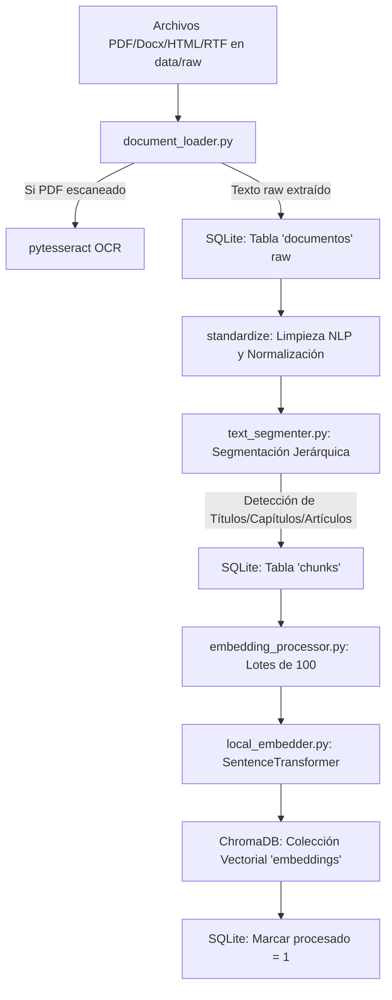
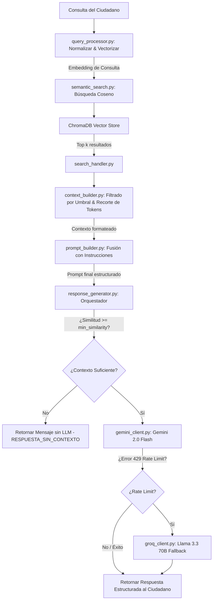

# Documento de Arquitectura Backend — Sistema RAG de Normas de Tránsito

Este documento detalla la arquitectura de software, los flujos de datos y la organización de componentes del backend del **Sistema de Asesoría Jurídica RAG** para las normas de tránsito en Colombia.

---

## 1. Vista General de la Arquitectura

El backend del sistema adopta un diseño **modular y desacoplado** basado en el patrón **RAG (Retrieval-Augmented Generation)**. La arquitectura se divide en dos fases fundamentales e independientes:
1.  **Pipeline de Ingesta (Offline/Batch)**: Encargado de cargar, limpiar, segmentar de forma estructurada e indexar el corpus normativo.
2.  **Pipeline de Consulta (Online/Real-time)**: Encargado de procesar la entrada del ciudadano, recuperar la información relevante de bases de datos locales, construir el contexto controlado y generar una respuesta fundamentada con LLMs mediante una estrategia de tolerancia a fallos.

---

## 2. Diagramas de Flujo (Mermaid)

### 2.1 Pipeline de Ingesta de Datos

Este flujo describe cómo los archivos legales en bruto se convierten en fragmentos vectorizados y estructurados dentro de las bases de datos locales:

### 2.2 Pipeline de Consulta y Generación (RAG)

Este flujo interactivo detalla el recorrido de una pregunta formulada por el ciudadano hasta la obtención de su respuesta:

---

## 3. Detalle de Módulos y Componentes

El backend se organiza en los siguientes paquetes y submódulos ubicados en `src/`:

### 3.1 Capa de Procesamiento (`src/processors/`)
*   **[document_loader.py](file:///Users/juanrojas/Documents/RAG/RAG-sistema-de-asesoria-juridica/src/processors/document_loader.py)**: Implementa los extractores específicos de formatos (`pypdf`, `python-docx`, `BeautifulSoup`). Ejecuta Tesseract OCR como fallback ante PDFs sin capa de texto. Limpia marcas de formato y páginas duplicadas.
*   **[text_segmenter.py](file:///Users/juanrojas/Documents/RAG/RAG-sistema-de-asesoria-juridica/src/processors/text_segmenter.py)**: Segmenta el texto por artículo. Rastrea dinámicamente en qué Título y Capítulo se encuentra el cursor del parser para adjuntar dicha información como metadatos jerárquicos a cada fragmento.
*   **[embedding_processor.py](file:///Users/juanrojas/Documents/RAG/RAG-sistema-de-asesoria-juridica/src/processors/embedding_processor.py)**: Orquesta la carga de chunks no procesados de la base de datos relacional y los envía a vectorizar en lotes (*batches*) de 100 unidades para optimizar el uso de RAM.

### 3.2 Capa Vectorial (`src/vector_store/`)
*   **[local_embedder.py](file:///Users/juanrojas/Documents/RAG/RAG-sistema-de-asesoria-juridica/src/vector_store/local_embedder.py)**: Carga el modelo local `paraphrase-multilingual-MiniLM-L12-v2` vía la librería `sentence-transformers` en CPU o GPU (CUDA si está disponible). Genera vectores de dimensión 384.
*   **[vector_manager.py](file:///Users/juanrojas/Documents/RAG/RAG-sistema-de-asesoria-juridica/src/vector_store/vector_manager.py)**: Encapsula el cliente local persistente de ChromaDB. Proporciona la interfaz para insertar lotes (`upsert_batch`).

### 3.3 Capa de Recuperación (`src/retrieval/`)
*   **[query_processor.py](file:///Users/juanrojas/Documents/RAG/RAG-sistema-de-asesoria-juridica/src/retrieval/query_processor.py)**: Normaliza la pregunta e invoca el modelo embedding local para vectorizar la consulta del usuario.
*   **[semantic_search.py](file:///Users/juanrojas/Documents/RAG/RAG-sistema-de-asesoria-juridica/src/retrieval/semantic_search.py)**: Realiza la consulta vectorial en ChromaDB y normaliza las distancias para obtener un score de similitud comprensible (de 0 a 1).
*   **[search_handler.py](file:///Users/juanrojas/Documents/RAG/RAG-sistema-de-asesoria-juridica/src/retrieval/search_handler.py)**: Proporciona la interfaz unificada de búsqueda capturando errores del motor relacional o vectorial.
*   **[rag_pipeline.py](file:///Users/juanrojas/Documents/RAG/RAG-sistema-de-asesoria-juridica/src/retrieval/rag_pipeline.py)**: Orquestador que une la búsqueda, el constructor de contexto y la creación de prompt.

### 3.4 Capa de Contexto y Generación (`src/context_builder/` y `src/generation/`)
*   **[context_builder.py](file:///Users/juanrojas/Documents/RAG/RAG-sistema-de-asesoria-juridica/src/context_builder/context_builder.py)**: Filtra resultados por relevancia mínima y trunca dinámicamente los fragmentos (reduciendo su tamaño de forma iterativa) o descarta documentos menos relevantes si el total excede el límite de tokens disponible del LLM.
*   **[prompt_builder.py](file:///Users/juanrojas/Documents/RAG/RAG-sistema-de-asesoria-juridica/src/context_builder/prompt_builder.py)**: Fusiona las instrucciones restrictivas del sistema y el contexto formateado de fuentes viales colombianas.
*   **[response_generator.py](file:///Users/juanrojas/Documents/RAG/RAG-sistema-de-asesoria-juridica/src/generation/response_generator.py)**: Cliente unificado de consumo que evalúa el umbral mínimo de similitud global y redirige de forma transparente la petición a Groq ante cuotas saturadas en Gemini.

---

## 4. Diseño y Esquema de Base de Datos

### 4.1 Base de Datos Relacional (SQLite: `data/normas.db`)

SQLite actúa como base de datos relacional y de auditoría interna de la ingesta de documentos. El esquema (definido en [schema.sql](file:///Users/juanrojas/Documents/RAG/RAG-sistema-de-asesoria-juridica/schema.sql)) contiene:

1.  **documentos**: Almacena los metadatos de los archivos cargados.
    *   `id` (PK), `nombre` (TEXT), `tipo` (CHECK 'ley', 'resolucion', 'decreto', 'manual', 'otro'), `url` (TEXT), `fecha_vigencia` (DATE), `fecha_descarga` (TIMESTAMP), `activo` (INTEGER 0 o 1).
2.  **articulos**: Artículos individuales extraídos de los documentos por la máquina de estados.
    *   `id` (PK), `doc_id` (FK documentos), `numero` (TEXT, ej. "55"), `titulo` (TEXT), `capitulo` (TEXT), `texto` (TEXT), `orden` (INTEGER), `tokens_estimados` (Generado automáticamente).
3.  **chunks**: Divisiones óptimas del artículo preparadas para la base vectorial.
    *   `id` (PK), `art_id` (FK articulos), `doc_id` (FK documentos), `texto` (TEXT), `tokens_estimados` (INTEGER), `metadata` (JSON), `embedding_ok` (INTEGER default 0).

### 4.2 Base de Datos Vectorial (ChromaDB: `data/chroma_db/`)

ChromaDB almacena los datos no estructurados indexados matemáticamente para búsquedas semánticas veloces:
*   **Colección**: `embeddings`.
*   **Modelo de Embeddings**: `paraphrase-multilingual-MiniLM-L12-v2` (dimensiones: 384).
*   **Campos indexados**:
    *   `id`: Identificador numérico del chunk (convertido a string).
    *   `embedding`: Vector de 384 floats.
    *   `document`: Texto limpio del fragmento (*chunk*).
    *   `metadata`: JSON con campos de búsqueda rápida (`fuente`, `articulo`, `capitulo`, `fecha_vigencia`).

---

## 5. Estrategia de Tolerancia a Fallos y Escalabilidad

### 5.1 Redundancia y Fallback de LLMs
La dependencia de un modelo en la nube gratuito obliga a diseñar un mecanismo de recuperación robusto:
1.  **Reintentos exponenciales**: En caso de errores transitorios de red, el cliente de Gemini realiza hasta 3 intentos con una espera incremental (multiplicador de 2 segundos por intento).
2.  **Transición de proveedor**: Si Gemini responde con un error de cuota agotada (HTTP 429), la excepción es capturada en `ResponseGenerator`. El flujo continúa enviando la consulta al cliente de Groq (Llama 3.3 70B) sin alterar la interfaz de usuario ni lanzar un error fatal.
3.  **Fallback final estático**: Si ambas APIs experimentan fallos recurrentes, se retorna un mensaje de seguridad invitando al usuario a reintentar su consulta o dirigirse a los canales oficiales.

### 5.2 Estrategia de Caché y Optimización de Costos (Futuro/Escalabilidad)
Para escalar el sistema a alta concurrencia sin incurrir en costos elevados de API, se contemplan dos optimizaciones en la arquitectura:
*   **Caché Semántica (Semantic Cache)**: Utilización de una base de datos Redis local para almacenar embeddings de consultas comunes ya resueltas. Si una nueva pregunta tiene una similitud semántica > 0.95 con una consulta previa, se devuelve la respuesta ya calculada sin llamar a los LLMs.
*   **Embeddings de Consulta locales**: Al realizarse la vectorización de la query de manera local, no se incurre en costos de llamadas de red para la fase de búsqueda.
